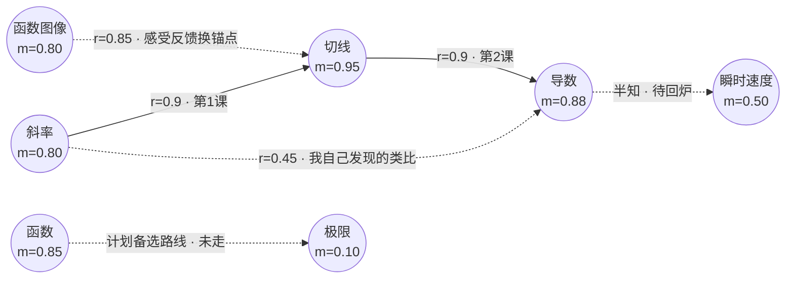

# 10 · 学习完成 · 知识图谱生成

## 1. 定位：学习的"毕业照"和"活地图"

图谱不是学完才造的——**它本来就是活文档**（02 §6），学习过程中持续生长；学习完成时做一次"封版生成"，输出描述**整个学习过程**的完整图谱。两种形态：

- **领域知识图谱**（我学会了什么）：知识点、关联、掌握度终值；
- **学习过程图谱**（我是怎么学会的）：实际走过的路径、顺序、卡点、突破点、我自己发现的连接、纠错记录——**"过程"是你要的重点**。

## 2. 终局图谱包含什么

**节点上**：知识点名称、终值掌握度 m、学习日期、练习次数、卡点标记（这一步当时最挣扎）；
**边上**：关联类型、r 终值、**何时建立**（探寻阶段 / 教学阶段 / 我自己类比发现——"我的连接"高亮）；
**过程上**：
- 真实路径 vs 计划路径的对比（哪里绕了路、为什么绕——如感受反馈换锚点）；
- 里程碑与门禁通过时刻、掌握度变化曲线（m-t）；
- 我的痕迹：提过的类比、纠错记录、质疑、兴趣漂移；
- **未完成区**：半知区/未知区如实标注——毕业照不美颜（防自欺，06）。

## 3. 输出格式（终端友好 + 通用）

| 格式 | 用途 |
|---|---|
| **Mermaid** | 贴进 Markdown/Obsidian/GitHub 直接渲染；终端里先看源码 |
| **Markdown 报告** | 图谱 + 逐节点"我是怎么学会的"叙事（每点一段：从哪个旧知识进来、哪次练习过关、卡在哪） |
| **JSON / GraphML** | 给工具链：Obsidian、Neo4j、未来系统迁移 |
| 终端 ASCII | `zhijing` 内实时预览 |
| 静态 HTML（可选） | 交互式图谱，浏览器查看、点节点看学习过程 |
| 精美图 SVG/PNG | 由 diagram-design skill 渲染的展示版（路径图、终局图谱），数据取自 graph_ops 输出 |

`/graph`、`/graduate` 由 agent 直接写入该目标目录的 `图谱导出/`，版本化、可回滚——写目录前先征得同意（09 §3）；`/graduate` **默认自动**附 diagram-design 精美版（`graduate.svg`）。

## 4. 生成时机

- **实时**：`/graph` 随时看当前图谱（活地图）；
- **阶段末**：每完成一个主题/里程碑 → "阶段性图谱"（小毕业照）；
- **学习完成**：`/graduate` 封版 → 终局图谱 + 学习报告；
- **不是终点**：完成后图谱继续生长（复习、新知持续追加），版本化管理——它是可续写的地图。

## 5. 过程图谱示例（Mermaid 示意）

要点：实线 = 真正走过的教学路径；虚线 = 计划而未走的路、我的自发连接、未完成的半知区——**一张图同时讲清"学会了什么"和"怎么学会的"**。

## 6. 与防自欺的接口

终局图谱上的 m 只信练习证据（08 §1）：没通过测验的点，哪怕我"觉得会了"，图上也如实标半知。毕业照的每一抹绿色都有成绩背书。
